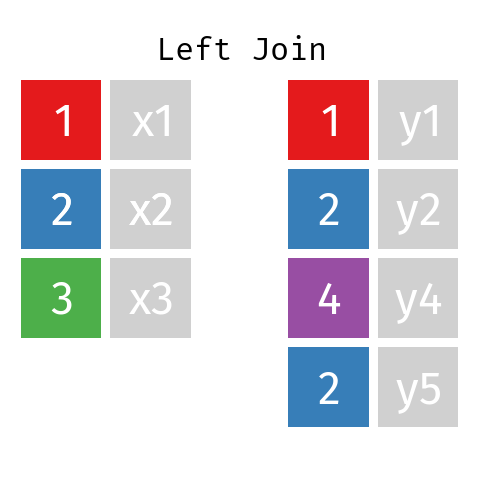
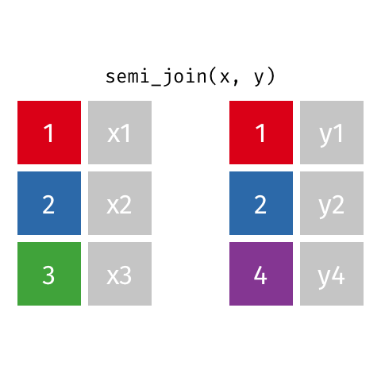

```{r setup, include=FALSE}
options(htmltools.dir.version = FALSE,  htmltools.preserve.raw = FALSE)
```


<!-- Uso de funcionalidades de xaringan extras -->

```{r xaringan-panelset, echo=FALSE}
xaringanExtra::use_panelset()
```

```{r xaringan-scribble, echo=FALSE}
xaringanExtra::use_scribble()
```

```{r xaringan-webcam, include = FALSE}
xaringanExtra::use_webcam()
```

```{r xaringan-logo, echo=FALSE}
xaringanExtra::use_logo(
  image_url = "https://raw.githubusercontent.com/estadisticaun/TendenciasCSU/master/Imagenes/LOGOSIMBOLO%20LATERAL.png", width = "115px",
  height = "133px")
```

```{r echo=FALSE}
xaringanExtra::style_panelset_tabs(
  active_foreground = "#0051BA",
  hover_foreground = "#d22",
  font_family = "Roboto"
)
```


<!-- INICIO DE LA PRESENTACIÓN -->

## Consideraciones para el uso adecuado de la presentación

  1.	<p align="justify">Dar click en la letra <b>H</b> o en el símbolo <b>?</b> para desplegar las distintas <b>opciones de navegación</b> que ofrece la presentación.</p>
  
---
class: inverse, center, middle

# Combinar variables

---
### Posibilidades de cruces de bases de datos en R con dplyr - por variables

.panelset.sideways[

.panel[.panel-name[`Filosofía al cruzar bases de datos <br><br> <FONT COLOR="#e34a33">La familia Join </FONT>`]

<H5><u>Propósito</u></H5>
<p align="justify"><FONT SIZE=3> Un cruce de bases de datos en R permite la combinación de las variables existentes en dos conjuntos de datos. Primero hace coincidir las observaciones por sus claves (llaves), luego copia las variables de una tabla a la otra.</font>

```{r gif1, fig.align='center', out.width='65%', fig.show='hold', echo=FALSE}
knitr::include_graphics('Gif/original-dfs.png')
```

<font size=1>Disponible en: <a href="https://github.com/gadenbuie/tidyexplain#semi-join">https://github.com/gadenbuie/tidyexplain#semi-join</a></font> 
]

.panel[.panel-name[`1. left_joint`]
<H5><u>Propósito</u></H5>
<p align="justify"><FONT SIZE=3>Todas las filas de x y todas las columnas de y en x. Las filas en x sin coincidencia en y tendrán valores NA en las nuevas columnas.
```{r gif2, fig.align='center', out.width='55%', fig.show='hold', echo=FALSE}
knitr:: include_graphics('Gif/left-join.gif')
```
<font size=1>Disponible en: <a href="https://github.com/gadenbuie/tidyexplain#semi-join">https://github.com/gadenbuie/tidyexplain#semi-join</a></font>
]

.panel[.panel-name[`1. left_joint`]
<H5><u>Propósito</u></H5>
<p align="justify"><FONT SIZE=3>Si hay varias coincidencias entre x e y, se devuelven todas las combinaciones de las coincidencias.

```{r gif3, fig.align='center', out.width='50%', fig.show='hold', echo=FALSE}
knitr:: 
```
<font size=1>Disponible en: <a href="https://github.com/gadenbuie/tidyexplain#semi-join">https://github.com/gadenbuie/tidyexplain#semi-join</a></font>
]
.panel[.panel-name[`2. right_join`]
<H5><u>Propósito</u></H5>
<p align="justify"><FONT SIZE=3>Todas las filas de y, y todas las columnas de x en y. Las filas en y sin coincidencia en x tendrán valores NA en las nuevas columnas.
```{r gif4, fig.align='center', out.width='50%', fig.show='hold', echo=FALSE}
knitr:: include_graphics('Gif/right-join.gif')
```
<font size=1>Disponible en: <a href="https://github.com/gadenbuie/tidyexplain#semi-join">https://github.com/gadenbuie/tidyexplain#semi-join</a></font>
]
.panel[.panel-name[`3. full_join`]
<H5><u>Propósito</u></H5>
<p align="justify"><FONT SIZE=3> Todas las filas y todas las columnas de x e y. Donde no hay valores coincidentes, devuelve NA para el que falta.
```{r gif5, fig.align='center', out.width='50%', fig.show='hold', echo=FALSE}
knitr:: include_graphics('Gif/full-join.gif')
```

<font size=1>Disponible en: <a href="https://github.com/gadenbuie/tidyexplain#semi-join">https://github.com/gadenbuie/tidyexplain#semi-join</a></font>
]
.panel[.panel-name[`4. inner_join`]
<H5><u>Propósito</u></H5>
<p align="justify"><FONT SIZE=3>Todas las filas de x donde hay valores coincidentes en y, y todas las columnas de x e y.
```{r gif6, fig.align='center', out.width='50%', fig.show='hold', echo=FALSE}
knitr:: include_graphics('Gif/inner-join.gif')
```

<font size=1>Disponible en: <a href="https://github.com/gadenbuie/tidyexplain#semi-join">https://github.com/gadenbuie/tidyexplain#semi-join</a></font>
]
.panel[.panel-name[`5. semi_join`]
<H5><u>Propósito</u></H5>
<p align="justify"><FONT SIZE=3>Todas las filas de x donde hay valores coincidentes en y, manteniendo solo las columnas de x.
```{r gif7, fig.align='center', out.width='50%', fig.show='hold', echo=FALSE}
knitr:: 
```

<font size=1>Disponible en: <a href="https://github.com/gadenbuie/tidyexplain#semi-join">https://github.com/gadenbuie/tidyexplain#semi-join</a></font>
]

.panel[.panel-name[`6. anti_join`]
<H5><u>Propósito</u></H5>
<p align="justify"><FONT SIZE=3>Todas las filas de x donde no hay valores coincidentes en y, manteniendo solo las columnas de x.
```{r gif8, fig.align='center', out.width='50%', fig.show='hold', echo=FALSE}
knitr:: include_graphics('Gif/anti-join.gif')
```

<font size=1>Disponible en: <a href="https://github.com/gadenbuie/tidyexplain#semi-join">https://github.com/gadenbuie/tidyexplain#semi-join</a></font>
]
]

---
class: inverse, center, middle

# Combinar individuos/casos
